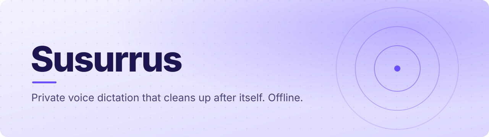

<a id="top"></a>

<p align="center">
  
</p>

<p align="center">
  
  
  
  
  
  
</p>

<p align="center">
  <b>Hold a key, speak, let go. Clean, formatted text lands in whatever app you are in.</b><br>
  A local, offline alternative to Wispr Flow for Windows. Your voice never leaves your machine,<br>
  and there is no subscription.
</p>

<p align="center">
  <a href="https://susurrus-xi.vercel.app"><b>Website</b></a> ·
  <a href="docs/assets/intro.mp4"><b>Watch the intro</b></a> ·
  <a href="#quick-start"><b>Quick start</b></a> ·
  <a href="#how-it-works"><b>How it works</b></a> ·
  <a href="#configuration"><b>Configuration</b></a> ·
  <a href="docs/USER_GUIDE.md"><b>User guide</b></a>
</p>

<br>

<p align="center">
  
</p>
<p align="center">
  <sub>Susurrus in eight seconds. <a href="docs/assets/intro.mp4">Full-quality video</a>.</sub>
</p>

<details>
<summary><b>Table of contents</b></summary>

- [Why Susurrus](#why-susurrus)
- [Features](#features)
- [See it work](#see-it-work)
- [How it works](#how-it-works)
- [Quick start](#quick-start)
- [Configuration](#configuration)
- [Compared](#compared)
- [Performance](#performance)
- [FAQ](#faq)
- [Documentation](#documentation)
- [Built with](#built-with)

</details>

## Why Susurrus

Speech recognition gives you raw text: no punctuation, a lot of *um* and *uh*, and run-on sentences.
Cloud dictation tools fix that by sending your audio to someone else's server and charging monthly.

**Susurrus splits the job in two.** One model hears you, a second edits what it heard, and both run on
your own machine. That separation is why the output reads like writing rather than a transcript.

```text
 mic ──▶  Qwen3-ASR          ──▶  Gemma on llama.cpp     ──▶  focused app
         hears what you said      edits what you meant         clean text pasted
```

## Features

- **Push-to-talk anywhere.** Hold `Ctrl+Shift+Space` in any app, speak, release. Text is pasted at the cursor.
- **Cleans as it types.** Removes fillers and stutters, fixes punctuation, and obeys spoken formatting such as *"bold"*, *"new line"* and *"in the list say…"*.
- **Voice commands on selected text.** Select text, hold `Ctrl+Shift+T` and say *"make this more professional"*. It is rewritten in place.
- **Modes.** `auto` picks one from your intent; or choose `correct`, `polish`, `summarize`, `smart_list`, `email`, `coding` or `meeting_notes`.
- **Custom vocabulary.** Names, jargon and model names are passed to the recogniser so they are heard correctly the first time.
- **Snippets.** Say *"my email"* and get the address. Say *"my signature"* and get the block.
- **Live overlay and tray.** A small floating status shows recording, transcribing and editing without stealing focus.
- **Control Center.** A dashboard for modes, temperature, vocabulary and history.

<p align="right"><a href="#top">Back to top ↑</a></p>

## See it work

**Dictation.** You say:

> *"I will list a few items bold this word that is groceries bananas and milk"*

You get:

> **Groceries**
> - Bananas
> - Milk

**Voice command.** With this selected:

> *Hey team, we might delay the release by two days due to some open bugs.*

you say *"make this sound professional and action-oriented"* and it becomes:

> *Team, we are adjusting our release schedule by 48 hours to resolve remaining critical issues.*

## How it works

1. **Capture.** A global hotkey records while held. Audio is normalised and, optionally, trimmed of silence with Silero VAD.
2. **Recognise.** Qwen3-ASR turns speech into text, biased toward your custom vocabulary.
3. **Edit.** A small Gemma model on a local `llama-server` removes fillers, applies formatting and rewrites to the chosen mode.
4. **Insert.** The result is pasted into the focused window, or replaces the current selection in command mode.

The recogniser and the editor sit behind a common backend interface, so either can be swapped without
touching the rest of the pipeline. The architecture and a mobile roadmap are in
[ARCHITECTURE.md](ARCHITECTURE.md) and [docs/MOBILE_IMPLEMENTATION_PLAN.md](docs/MOBILE_IMPLEMENTATION_PLAN.md).

## Quick start

Windows 10 or 11 and Python 3.10+. A dedicated NVIDIA GPU is recommended for sub-second editing; CPU works.

```bash
git clone https://github.com/ParthVarekar/whisper_flow_clone_local.git
cd whisper_flow_clone_local
start.bat
```

`start.bat` checks dependencies, starts the local `llama-server`, opens the Control Center and puts
Susurrus in the system tray. Then hold `Ctrl+Shift+Space` and talk.

Prefer containers or a single executable? The repository includes a `Dockerfile` and a
`pyinstaller.spec`.

<p align="right"><a href="#top">Back to top ↑</a></p>

## Configuration

```toml
mode = "auto"
writing_style = "default"
smart_formatting = true
dictation_hotkey = "ctrl+shift+space"
command_hotkey = "ctrl+shift+t"

# Heard correctly the first time
dictionary = ["Susurrus", "llama.cpp", "GGUF", "Qwen3-ASR"]

[snippets]
"my email" = "you@example.com"
"my signature" = "Best regards,\nYour Name"
```

Everything else, including model paths, GPU layers, threads and VAD, is in
[`config.example.toml`](config.example.toml).

## Compared

| | Cloud dictation APIs | Subscription voice apps | Susurrus |
|---|---|---|---|
| Audio leaves your machine | Yes | Yes | **Never** |
| Monthly cost | Per minute | $10 to $15 | **Free** |
| Formatting | Raw text | Basic capitalisation | **LLM editing, lists, bold** |
| Edit existing text by voice | No | Limited | **Yes, in any app** |
| Custom vocabulary and snippets | Costly custom models | Rigid rules | **Both, built in** |

A detailed breakdown: [docs/WISPR_FLOW_COMPARISON.md](docs/WISPR_FLOW_COMPARISON.md).

## Performance

Model sizing from [docs/PERFORMANCE.md](docs/PERFORMANCE.md). Total memory is roughly the recogniser plus the editor plus about 200 MB.

| Setup | Disk | RAM |
|---|---|---|
| Small recogniser (`base.en`) | 142 MB | ~0.7 GB |
| 1B editor (`gemma-3-1b-it` Q4_K_M) | ~1 GB | ~1.5 GB |
| **Both together** | **~1.2 GB** | **~2.5 GB**, comfortable on an 8 GB laptop |

GPU offload is a runtime flag on the editor (`-ngl`), so you can trade speed for VRAM without rebuilding.

## FAQ

<details>
<summary><b>Does it need the internet?</b></summary>
<br>
Not after the models are downloaded. Recognition and editing both run locally.
</details>

<details>
<summary><b>Is anything stored or sent anywhere?</b></summary>
<br>
No audio or text leaves the machine. See the <a href="docs/PRIVACY_POLICY.md">privacy policy</a> and <a href="docs/SECURITY_AND_COMPLIANCE.md">security notes</a>.
</details>

<details>
<summary><b>It mishears a name.</b></summary>
<br>
Add it to <code>dictionary</code>. Vocabulary is passed to the recogniser, so it is heard correctly rather than patched afterwards.
</details>

<details>
<summary><b>It is slow on my laptop.</b></summary>
<br>
Use a smaller recogniser, raise GPU layers on the editor, or turn on VAD. See <a href="docs/TROUBLESHOOTING.md">troubleshooting</a>.
</details>

## Documentation

| Document | Covers |
|---|---|
| [docs/USER_GUIDE.md](docs/USER_GUIDE.md) | Hotkeys, modes, spoken commands |
| [docs/PERFORMANCE.md](docs/PERFORMANCE.md) | Model sizing, GPU, threads, VAD |
| [docs/TROUBLESHOOTING.md](docs/TROUBLESHOOTING.md) | Common problems |
| [docs/FAQ.md](docs/FAQ.md) | Questions and answers |
| [ARCHITECTURE.md](ARCHITECTURE.md) | How the pipeline fits together |

## Built with

Python · Qwen3-ASR · Gemma · llama.cpp · whisper.cpp tooling · Silero VAD · Docker · PyInstaller.
The marketing site is Next.js on Vercel: [susurrus-xi.vercel.app](https://susurrus-xi.vercel.app).

<p align="center"><sub>MIT licensed · Built for speed, precision and privacy</sub></p>
